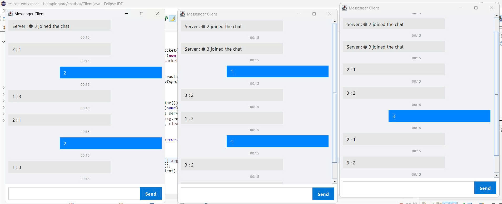

<h2 align="center">
    <a href="https://dainam.edu.vn/vi/khoa-cong-nghe-thong-tin">
    🎓 Faculty of Information Technology (DaiNam University)
    </a>
</h2>

<h2 align="center">
   💬 Ứng dụng Chat Client-Server sử dụng TCP
</h2>

<div align="center">
    <p align="center">
        
        
        
    </p>

[](https://www.facebook.com/DNUAIoTLab)
[](https://dainam.edu.vn/vi/khoa-cong-nghe-thong-tin)
[](https://dainam.edu.vn)

</div>


## 📖 1. Giới thiệu
Ứng dụng **Chat Client - Server** được xây dựng nhằm mô phỏng mô hình **Client - Server** trong môn học *Mạng máy tính*.  
Hệ thống cho phép nhiều client cùng kết nối đến server để gửi/nhận tin nhắn theo giao thức **TCP Socket**.  

**Chức năng chính:**
- Kết nối client-server thông qua TCP.
- Trò chuyện thời gian thực.
- Hỗ trợ nhiều client cùng lúc.
- Lưu trữ tin nhắn phục vụ quản lý và truy xuất sau này.
- Giao diện console/GUI trực quan.


## 🔧 2. Ngôn ngữ & Công nghệ
- **Ngôn ngữ lập trình:** Python (hoặc Java/C# tùy phiên bản).  
- **Giao thức:** TCP/IP (Socket Programming).  
- **Môi trường phát triển:** VS Code / PyCharm / Eclipse.  
- **Hệ điều hành:** Windows / Linux / macOS.  


## 🖼️ 3. Hình ảnh minh họa


## 📝 4. Hướng dẫn cài đặt và sử dụng

### 📦 Phần 1: Biên dịch chương trình
Di chuyển vào thư mục chứa mã nguồn, sau đó biên dịch các file Java:

```bash
javac Server.java Client.java
```

### ▶️ Phần 2: Chạy chương trình Server
Khởi động **Server** trước:

```bash
java Server
```

Màn hình **Server Chat** sẽ xuất hiện và chờ Client kết nối.

### 💻 Phần 3: Chạy chương trình Client
Mở một terminal khác và chạy:

```bash
java Client
```

Màn hình **Client Chat** sẽ hiện ra và tự động kết nối tới Server.


### 🌐 Phần 4: Kết nối nhiều Client
- Mở thêm nhiều cửa sổ terminal (hoặc chạy trên nhiều máy).  
- Thực hiện lệnh:

```bash
java Client
```

👉 Mỗi cửa sổ sẽ là một người dùng khác tham gia chat.


### 🚀 Sử dụng ứng dụng

Kết nối: Client sẽ tự động kết nối đến Server sau khi chạy chương trình.

Gửi tin nhắn: Gõ tin nhắn trong cửa sổ console và nhấn Enter để gửi.

Nhận tin nhắn: Tất cả tin nhắn từ các Client khác sẽ hiển thị trên màn hình chat.

Kết nối nhiều Client: Có thể mở nhiều cửa sổ Client để nhiều người cùng tham gia chat.

Ngắt kết nối: Đóng cửa sổ Client hoặc nhấn Ctrl+C để thoát khỏi ứng dụng.

## Thông tin cá nhân
**Họ tên**: Bùi Văn Trường  
**Lớp**: CNTT 16-03.  
**Email**: buitruong@gmail.com.

© 2025 AIoTLab, Faculty of Information Technology, DaiNam University. All rights reserved.
