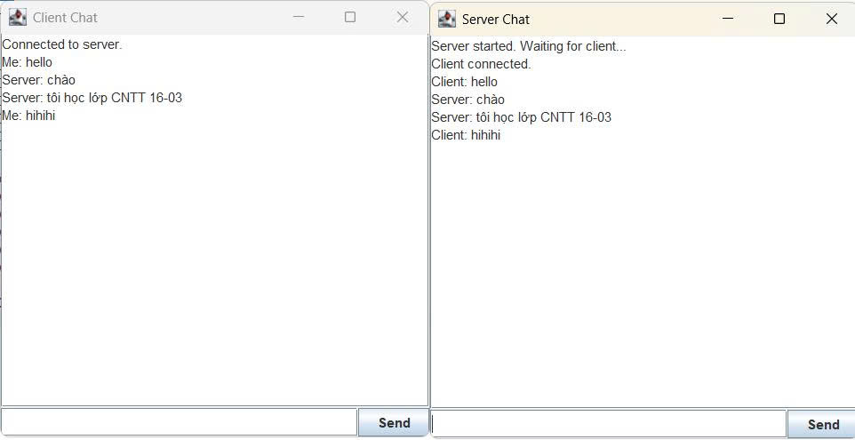

<h2 align="center">
    <a href="https://dainam.edu.vn/vi/khoa-cong-nghe-thong-tin">
    🎓 Faculty of Information Technology (DaiNam University)
    </a>
</h2>
<h2 align="center">
   Ứng dụng chat Client-Server sử dụng TCP
</h2>

    

        
        
        
    

## 📖 1. Giới thiệu
Ứng dụng Chat Client - Server được xây dựng nhằm mô phỏng mô hình Client - Server trong môn học Mạng máy tính.  
Hệ thống cho phép nhiều client cùng kết nối đến server để gửi/nhận tin nhắn theo giao thức TCP Socket.  

Chức năng chính:
- Kết nối client-server thông qua TCP.
- Trò chuyện thời gian thực.
- Hỗ trợ nhiều client cùng lúc.
- Giao diện console/GUI trực quan.

## 🔧2. Ngôn ngữ lập trình sử dụng:
- Ngôn ngữ lập trình: Python (hoặc Java/C# tuỳ phiên bản).
- Giao thức: TCP/IP (Socket Programming).
- Môi trường phát triển: VS Code / PyCharm / Eclipse.
- Hệ điều hành: Windows / Linux / macOS.

Cài đặt chức năng lưu trữ tin nhắn phục vụ quản lý và truy xuất sau này

## 🚀 3. Hình ảnh các chức năng

## 🚀 3. Các bước cài đặt

📦 1. Cài đặt thư viện cần thiết
    pip install -r requirements.txt

▶️ 3. Chạy chương trình Server
    python server.py

💻 4. Chạy chương trình Client
    python client.py
    
🌐 5. Kết nối nhiều client
    - Mở thêm nhiều cửa sổ terminal và chạy python client.py.
    - Mỗi cửa sổ sẽ là một người dùng khác tham gia chat.

📝 4. License

© 2025 AIoTLab, Faculty of Information Technology, DaiNam University. All rights reserved.